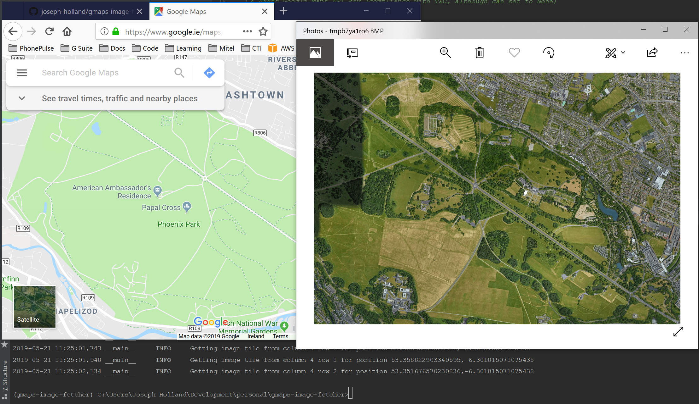

# Google Maps Static API Image Downloader

Simple tool to download image tiles from Google Maps via the Static-Maps API and Merge them back together using GDAL API



## How it works

* Provide the Extent coordinates of your area of interest as GEOJSON foormat

* Give the tool two sets of latitudes and longitudes for the north-west and south-east of the area you wish to download
the imagery from
* The tool calculates how many individual image tiles it needs to get from Google's Static-Maps API and begins to
download them
* All image tiles are stitched together and a preview showed onscreen
* The image is also saved to a file

## Installation

### Prerequisites

* A GOOGLE_MAPS_API_KEY is required as per the T&Cs of Google's Static-Maps API (plenty of tutorials online showing you
how to generate this, Google it)

### Existing Python environment

If you wish to download this into an existing Python environment you can us pip to install the tool like so:

```bash
pip install git+https://github.com/hubert10/googlemaps-image-downloads.git

pip install -r requirements.txt
```

### Windows executable

If on Windows platform I've compiled a release of the tool into an exe using [PyInstaller](https://www.pyinstaller.org/)

Just download the latest release from the
[Release section](https://github.com/hubert10/googlemaps-image-downloads/releases) of the repo

## Running

1. Set your GOOGLE_MAPS_API_KEY environment variable

    Windows
    ```bash
    set GOOGLE_MAPS_API_KEY=AIzaS.............
    ```
    
    Linux
    ```bash
    export GOOGLE_MAPS_API_KEY=AIzaS.............
    ```
    
2. Run the script to download tiles of any Region Size:

    ```bash
    python downloads/download_tiled_images.py
    ```

3. Adds metadata to the corresponding tiles:

    ```bash
    python downloads/add_metadata_tiles_images.py
    ```

4. Merge all tiles together:

    ```bash
    python downloads/merge_large_nbr_tiles.py
    ```

    